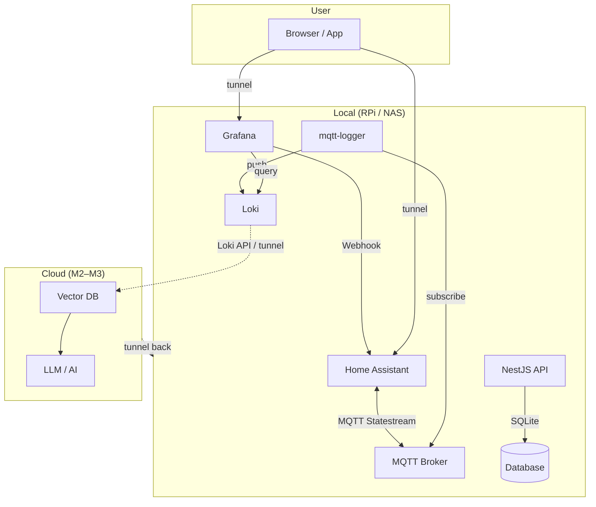

# Home Sentry - Smart Home Monitoring Platform

A self-hosted smart home monitoring and management platform combining Home Assistant, MQTT, Loki logging, and a NestJS backend API for device state collection, visualization, and alerting.

## Overview

Home Sentry provides a privacy-focused smart home infrastructure with a **local + cloud** split:

- **Local (RPi):** Device state collection, Loki logs, Grafana dashboards, alerts, NestJS API — data stays on-prem
- **Cloud:** Vector DB + AI pipeline (M2–M3) — runs where GPU/LLM is available; pulls logs from Loki via tunnel
- **Access:** Tunnel (e.g. Cloudflare Tunnel, Tailscale) from RPi to expose local services for remote access

## Architecture



## Data Flow

1. **Local:** Home Assistant → MQTT → mqtt-logger → Loki; Grafana queries Loki for dashboards and alerts
2. **Alerts:** Grafana → Webhook → Home Assistant → iOS push
3. **Cloud (M2–M3):** AI pipeline pulls logs from Loki (via tunnel) → Vector DB → LLM for semantic analysis and recommendations
4. **Access:** User tunnels back to RPi to access Grafana, HA, etc.

> Architecture diagram uses [Mermaid](https://mermaid.js.org/) (renders in GitHub/GitLab). Local vs Cloud split keeps sensitive device data on-prem while offloading AI compute.

## Project Structure

```
home-sentry/
├── backend/home-sentry/     # NestJS REST API (local)
├── home-assistant/          # HA config (automations, mqtt, blueprints)
├── mosquitto/               # MQTT message broker (local)
├── loki/                    # Log aggregation (local)
├── grafana/                 # Monitoring & visualization (local)
├── mqtt-logger/             # MQTT → Loki bridge (local)
├── nginx/                   # Reverse proxy
├── python-matter-server/    # Matter protocol support
├── query-ha.ps1             # PowerShell log query utility
├── ai-analysis/             # (M2–M3) Cloud: vector DB, AI pipeline
└── README.md
```

## Current Features

### Implemented

| Feature | Description |
|---------|-------------|
| Device state logs | Sensor, light, switch, door/window state changes written to Loki |
| Grafana dashboards | Device history from Loki queries |
| **Window close reminder** | Grafana alert → HA Webhook → iOS push when windows are left open |
| Log query | `query-ha.ps1` queries Loki by device type, name, time range |
| Home/room/device management | NestJS API + SQLite |
| Audit logging | Full audit trail of API changes |

### Milestones

| Milestone | Status | Description |
|-----------|--------|--------------|
| [M1](#milestone-1-foundation) | ✅ Done | Infrastructure, data pipeline, window alert |
| [M2](#milestone-2-log-ingestion--vector-database) | 🔲 Next | Ingest Loki logs into vector DB for semantic search |
| [M3](#milestone-3-ai-analysis--insights) | 🔲 Todo | AI analyzes logs, generates energy-saving recommendations |
| [M4](#milestone-4-custom-events--alerts) | 🔲 Todo | Expand Grafana alerts (climate, lights, energy, etc.) |
| [M5](#milestone-5-ai-driven-automation) | 🔲 Todo | Optional: surface AI insights to HA / automation |

---

#### Milestone 1: Foundation

**Status: ✅ Done**

- MQTT broker, Loki, Grafana, mqtt-logger, Home Assistant, nginx
- Device state logs (sensor, light, switch, binary_sensor, climate, etc.) → Loki
- Window close alert (Grafana → HA Webhook → iOS push)
- NestJS backend (homes, rooms, devices, audit)
- `query-ha.ps1` for Loki log queries

**Remaining (optional):** Root docker-compose ✅, Grafana provisioning as code, `.env.example` ✅

---

#### Milestone 2: Log Ingestion & Vector Database

**Status: 🔲 Next** (runs on **cloud**)

- **Goal:** Ingest Loki logs into a vector database for semantic search and AI analysis
- **Tasks:**
  - Add vector DB (e.g. Qdrant, Chroma, pgvector, or Milvus)
  - Build ingestion pipeline: Loki API (via tunnel) → parse logs → embed → store in vector DB
  - Support incremental sync (periodic or event-driven)
- **Output:** Logs queryable by meaning, not just keyword/LogQL

---

#### Milestone 3: AI Analysis & Insights

**Status: 🔲 Todo** (runs on **cloud**)

- **Goal:** Use AI to analyze device logs and generate energy-saving recommendations
- **Tasks:**
  - LLM integration (cloud API or self-hosted GPU)
  - Query vector DB for relevant log context (usage patterns, anomalies)
  - Prompt design: summarize patterns, identify waste, suggest optimizations
  - Outputs: peak usage, idle devices, temperature setpoints, lighting habits, etc.
- **Delivery:** API endpoint, CLI, or scheduled report (e.g. weekly digest)

---

#### Milestone 4: Custom Events & Alerts

**Status: 🔲 Todo**

- **Current:** Only "window open" reminder
- **Add:** More Grafana alert rules + HA automations:
  - Climate running too long / abnormal temperature
  - Lights on with no occupancy
  - Temperature/humidity threshold exceeded
  - Energy consumption anomalies
  - Door lock and security events
- **Implementation:** Grafana alert rules → Webhook → HA automations → push

---

#### Milestone 5: AI-Driven Automation

**Status: 🔲 Todo** (Optional)

- Surface AI recommendations in HA (e.g. actionable notifications)
- Optional: auto-adjust schedules or suggest automations based on AI insights

## Quick Start

### Prerequisites

- Docker & Docker Compose
- Node.js 18+ (for backend development)
- PowerShell (for query-ha.ps1)

### Start Services

```bash
# Start components (in dependency order)
cd mosquitto && docker-compose up -d
cd ../loki && docker-compose up -d
cd ../grafana && docker-compose up -d
cd ../mqtt-logger && docker-compose up -d
cd ../home-assistant && docker-compose up -d
cd ../nginx && docker-compose up -d
```

### Backend API

```bash
cd backend/home-sentry
npm install
npm run start:dev
# API: http://localhost:3000
```

### Access URLs

| Service | URL |
|---------|-----|
| Home Assistant | http://localhost:8123 |
| Grafana | http://localhost:9280 |
| Loki API | http://localhost:3100 |
| MQTT Broker | localhost:1883 |

## Log Query (query-ha.ps1)

```powershell
# By device type
.\query-ha.ps1 -device sensor

# Fuzzy match by name
.\query-ha.ps1 -Name "bedroom"

# Time range (seconds)
.\query-ha.ps1 -Start 3600 -End 1800

# Limit results
.\query-ha.ps1 -Limit 500 -Last 50
```

## Grafana Alerts → Home Assistant

Current "window close" alert flow:

1. Grafana alert rule (e.g. `binary_sensor` with `state == "on"`)
2. Alert triggers POST to HA Webhook
3. HA automation `grafana_ios_push_window_state` receives and sends iOS notification

To add new alerts, reuse the same Webhook or add new ones, and extend `automations.yaml` with corresponding automations.

## Configuration

### Environment Variables

Create `.env` in project root:

```bash
ADMIN_USERNAME=admin
ADMIN_PASSWORD=change_me_securely
JWT_SECRET=your-super-secret-jwt-key
LOKI_HOST=192.168.1.100  # Loki host for query-ha.ps1
```

### Ports

| Service | Port |
|---------|------|
| Home Assistant | 8123 |
| Grafana | 9280 (maps to container 3000) |
| Loki | 3100 |
| MQTT | 1883 |
| NestJS | 3000 |

## Troubleshooting

- **MQTT connection fails**: Ensure Mosquitto container is running and network is reachable
- **No Loki data**: Verify mqtt-logger is running and HA is publishing MQTT states
- **Grafana alerts not pushing**: Check Webhook URL and that HA automations are enabled

## Backlog / Later Improvements

- **Grafana provisioning as code:** Mount `grafana/provisioning/` to `/etc/grafana/provisioning`; provision Loki datasource, window-close alert rule, HA Webhook contact point; document NAS volume path (e.g. `GRAFANA_DATA_PATH=/mnt/nas/grafana`)

## Contributing

1. Fork the repository
2. Create a feature branch (`git checkout -b feature/xxx`)
3. Commit changes (`git commit -m 'Add xxx'`)
4. Push and open a Pull Request
