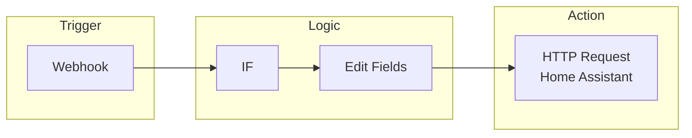
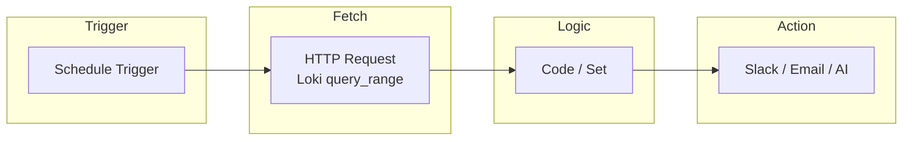
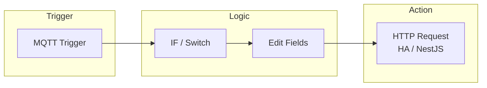
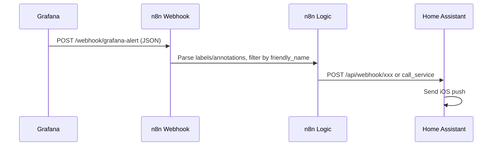

# n8n Integration (Explore)

Branch: `feature/n8n-integration`

## Architecture: Data → n8n Nodes

How each Home Sentry data source maps into n8n **trigger** and **input** nodes (n8n-style flow).

### Data sources → n8n node types

| Data source      | How it reaches n8n                    | n8n node(s)              |
|------------------|---------------------------------------|--------------------------|
| Grafana alerts   | Alert contact point POSTs to n8n     | **Webhook**              |
| Loki logs        | n8n calls Loki HTTP API (on schedule) | **Schedule** + **HTTP Request** |
| MQTT messages    | n8n subscribes to broker (same network) | **MQTT Trigger**       |
| Home Assistant   | n8n calls HA REST or HA sends webhook | **HTTP Request** / **Webhook** |
| NestJS backend   | n8n calls API or backend sends webhook | **HTTP Request** / **Webhook** |

---

### Workflow 1: Grafana alert → n8n → HA (node flow)

n8n-style: trigger → logic → action nodes.

- **Webhook**: receives POST from Grafana contact point (alert JSON).
- **IF**: filter by `labels.friendly_name`, `state`, etc.
- **Edit Fields**: shape payload for HA (e.g. `notify.notify`).
- **HTTP Request**: call HA REST API or webhook.

---

### Workflow 2: Scheduled Loki query → n8n (node flow)

- **Schedule Trigger**: e.g. every 1h.
- **HTTP Request**: `GET http://loki:3100/loki/api/v1/query_range?query=...`
- **Code / Set**: parse response, aggregate, filter.
- **Slack / Email / AI**: send notification or forward to AI pipeline.

---

### Workflow 3: MQTT event → n8n (node flow)

- **MQTT Trigger**: subscribe to `homeassistant/#` or specific topics (n8n must be on same network as broker).
- **IF / Switch**: route by topic or payload (e.g. domain, entity_id).
- **Edit Fields**: map MQTT payload to HA/NestJS format.
- **HTTP Request**: call HA service or NestJS API.

---

### End-to-end: Grafana alert → n8n → HA (sequence)

## Where n8n fits

- **Grafana alerts** → Webhook → n8n → custom logic (filter, enrich) → HA / Slack / email
- **Loki logs** → n8n (schedule) → query Loki API → transform → notifications or AI pipeline
- **NestJS API** → n8n workflows for device/room automation triggers
- **MQTT** → n8n MQTT node (same network as broker) for event-driven workflows

## Options to explore

1. Run n8n in Docker alongside other services (same `home-sentry` network).
2. Use Webhook + HTTP Request nodes to talk to Loki, Grafana, HA, NestJS.
3. Put n8n between Grafana and HA (e.g. conditional routing) instead of or in addition to direct webhook.

## Next steps

- [ ] Add n8n to docker-compose (or separate compose)
- [ ] Document webhook/API endpoints for Loki, HA, NestJS
- [ ] Example workflow: window alert → n8n → HA
